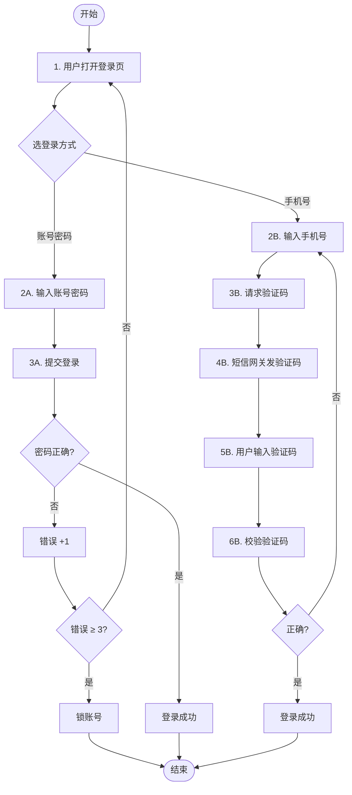

```mermaid
flowchart TD
    Start([开始]) --> S1[1. 用户打开登录页]
    S1 --> D1{选登录方式}

    D1 -- 账号密码 --> S2A[2A. 输入账号密码]
    S2A --> S3A[3A. 提交登录]
    S3A --> D2{密码正确?}
    D2 -- 是 --> OK1[登录成功]
    D2 -- 否 --> S4A[错误 +1]
    S4A --> D3{错误 ≥ 3?}
    D3 -- 是 --> Lock[锁账号]
    D3 -- 否 --> S1
    Lock --> End1([结束])
    OK1 --> End1

    D1 -- 手机号 --> S2B[2B. 输入手机号]
    S2B --> S3B[3B. 请求验证码]
    S3B --> S4B[4B. 短信网关发验证码]
    S4B --> S5B[5B. 用户输入验证码]
    S5B --> S6B[6B. 校验验证码]
    S6B --> D4{正确?}
    D4 -- 是 --> OK2[登录成功]
    D4 -- 否 --> S2B
    OK2 --> End1
```
