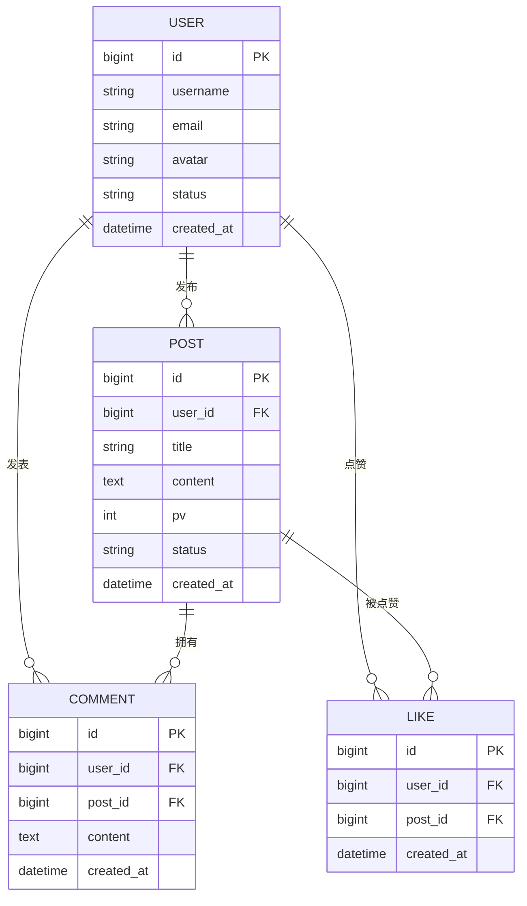

```mermaid
erDiagram
    USER ||--o{ POST : "发布"
    USER ||--o{ COMMENT : "发表"
    USER ||--o{ LIKE : "点赞"
    POST ||--o{ COMMENT : "拥有"
    POST ||--o{ LIKE : "被点赞"

    USER {
        bigint id PK
        string username
        string email
        string avatar
        string status
        datetime created_at
    }

    POST {
        bigint id PK
        bigint user_id FK
        string title
        text content
        int pv
        string status
        datetime created_at
    }

    COMMENT {
        bigint id PK
        bigint user_id FK
        bigint post_id FK
        text content
        datetime created_at
    }

    LIKE {
        bigint id PK
        bigint user_id FK
        bigint post_id FK
        datetime created_at
    }
```
