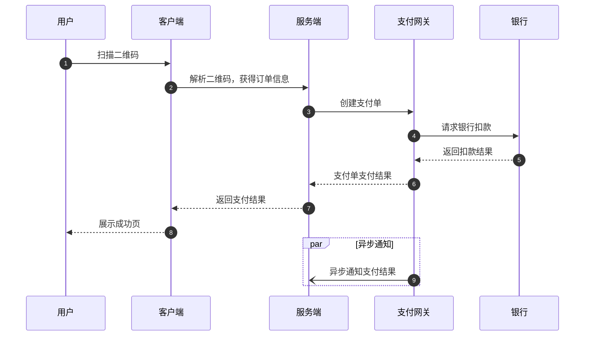

```mermaid
sequenceDiagram
    autonumber
    participant U as 用户
    participant C as 客户端
    participant S as 服务端
    participant P as 支付网关
    participant B as 银行

    U->>C: 扫描二维码
    C->>S: 解析二维码，获得订单信息
    S->>P: 创建支付单
    P->>B: 请求银行扣款
    B-->>P: 返回扣款结果
    P-->>S: 支付单支付结果
    S-->>C: 返回支付结果
    C-->>U: 展示成功页

    par 异步通知
        P-)S: 异步通知支付结果
    end
```
