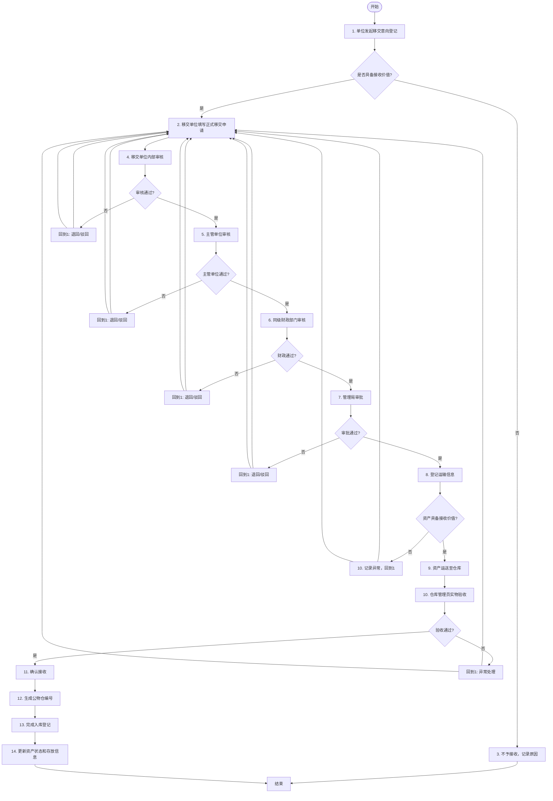

```mermaid
flowchart TD
    Start([开始]) --> S1[1. 单位发起移交意向登记]
    S1 --> D1{是否具备接收价值?}
    D1 -- 是 --> S2[2. 移交单位填写正式移交申请]
    D1 -- 否 --> D11[3. 不予接收，记录原因]
    D11 --> End1[结束]
    S2 --> S3[4. 移交单位内部审核]
    S3 --> D2{审核通过?}
    D2 -- 是 --> S4[5. 主管单位审核]
    D2 -- 否 --> D21[回到1: 退回/驳回]
    D21 --> S2
    S4 --> D3{主管单位通过?}
    D3 -- 是 --> S5[6. 同级财政部门审核]
    D3 -- 否 --> D22[回到1: 退回/驳回]
    D22 --> S2
    S5 --> D4{财政通过?}
    D4 -- 是 --> S6[7. 管理局审批]
    D4 -- 否 --> D23[回到1: 退回/驳回]
    D23 --> S2
    S6 --> D5{审批通过?}
    D5 -- 是 --> S7[8. 登记运输信息]
    D5 -- 否 --> D24[回到1: 退回/驳回]
    D24 --> S2
    S7 --> D6{资产具备接收价值?}
    D6 -- 是 --> S8[9. 资产运送至仓库]
    D6 -- 否 --> D25[10. 记录异常，回到1]
    D25 --> S2
    S8 --> S9[10. 仓库管理员实物验收]
    S9 --> D7{验收通过?}
    D7 -- 是 --> S10[11. 确认接收]
    D7 -- 否 --> D26[回到1: 异常处理]
    D26 --> S2
    S10 --> S11[12. 生成公物仓编号]
    S11 --> S12[13. 完成入库登记]
    S12 --> S13[14. 更新资产状态和存放信息]
    S13 --> End1[结束]
    D26 --> S2
    D21 --> S2
    D22 --> S2
    D23 --> S2
    D24 --> S2
    D25 --> S2
```