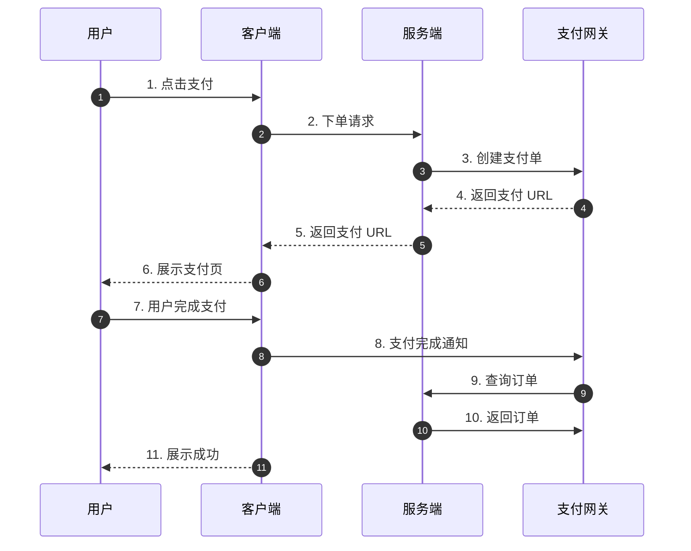

```mermaid
sequenceDiagram
    autonumber
    participant U as 用户
    participant C as 客户端
    participant S as 服务端
    participant P as 支付网关

    U->>C: 1. 点击支付
    C->>S: 2. 下单请求
    S->>P: 3. 创建支付单
    P-->>S: 4. 返回支付 URL
    S-->>C: 5. 返回支付 URL
    C-->>U: 6. 展示支付页
    U->>C: 7. 用户完成支付
    C->>P: 8. 支付完成通知
    P->>S: 9. 查询订单
    S->>P: 10. 返回订单
    C-->>U: 11. 展示成功
```
